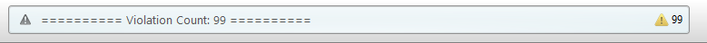

# Checkers

This is our repo for our Checkers game.
# Sunset Checkers

Authors:

* Peter Gagliardi
* Jennifer Bondarchuk
* Stephen Slatky
* Khanh Nguyen

## Compilation

### Server

To compile the server, you must have Mono installed for the
target platform.

From the `/server` directory

* **Mac**: run `make`
* **Windows:** run `compile.bat`

To run the server: 

* **Mac**: make run
* **Windows**: double click server.exe

### Client

Open the project in Unity Engine. Click File > Build Settings
and follow the dialog to produce an executable for the desired
platform(s)

To run the program open your file browser and click the binary file
created by unity. It will be named SunsetCheckers. 


## Usage

### Server

1. The server must be running before any clients are connected.
   run `Server.exe` after compiling it.
2. Make sure to allow connections to the server on port `1234`.
   Depending on the desired setup, this may be on the local network
   or across the Internet.

### Client

1. Edit `server_ip.txt` and replace the IP address with that
   of the server. **IMPORTANT**: This file must be in the same
   directory as the client executable.
2. Have each player run their copy of the client program.
3. Each player should click the Play option in the main menu to
   connect to the server.

## Release Notes

### Version 1.0

This is our initial stable version of Sunset Checkers.

### Version 1.1

This version adds no features. We ran unit tests, linting and fixed
a few bugs.

## Git Branches

* `master` - this branch is where our stable copy of the
  project is stored. We will aim to update this weekly. Never
  commit directly to `master`.
* `develop` - this branch is for staging changes to be
  merged into master. Never commit directly to `develop`
  unless adding a template file that multiple people will
  be working on (e.g. one of the documentation
* feature branches - Every time one of us works on a portion of
  the project, create a new branch. Name it something descriptive
  and include your name. Examples: `peter-checkerboard-spec`
  or `khanh-menus`. Feature branches should only be merged through
  pull requests (see below)

### Process for creating feature branches

1. Switch to `develop`: `git checkout develop`
2. Checkout a new branch: `git checkout -b <branch-name>`
3. Work on the project and `git commit` as needed
4. The first time you push a new branch to Bitbucket,
   you must make sure your local repo keeps track of
   the branches on Bitbucket:
   `git push -u origin <branch-name>`
5. Every subsequent push to Bitbucket is simpler:
   `git push`

### Process for merging feature branches

1. On Bitbucket, go to Pull Requests and click the
   `Create Pull Request` button on the top right
2. You must select two branches:
   * left: select your feature branch
   * right: select `develop`
3. Select someone to review your changes.
4. Fill out the pull request form. Give a brief overview of
   your changes.
5. Also, please check `Close branch`. This deletes the branch
   pointer on Bitbucket which reduces clutter.
6. Click the submit button
7. Now, get the reviewer to look over the pull request. The
   reviewer should click `Approve` at the top right, or leave
   comments explaining any necessary changes that need to be
   made before approval
8. Once approved, the author of the pull request can hit
   Merge to finish the process.

## Documentation

Since Word Online has limited functionality, we decided
to use a different solution. Our documentation will be
written in Markdown format (for its simplicity) and then
Pandoc will be used to convert it to a PDF with a table of
contents.

Documentation is stored in the `doc/` folder.

To set up Pandoc, use these commands:

```
# install pandoc
sudo apt install pandoc

# Pandoc needs these dependencies for PDF output
sudo apt texlive-fonts-recommended texlive-latex-extra
```

To compile the documentation, simply go into the
`doc/` folder and run `make` which has all the necessary
Pandoc commands.

## Testing Client

1. Open project in unity
2. Go to Window > Test Runner
3. In EditMode click "Run All" to run all tests

Each subsection contains all the tests for 1 class in the project.

Code Coverage

We used Unity Test Tools to create tests for the client. We covered all functions that did not return void. To test our GUI functions and classes would have been much more time consuming than we had initially planned for. Most of our client side code was covered with the tests we provide.


For the server there was no unit tests created. To create a unit test environment for the server would be another
project. It requires building a async process where sockets are created and used to send data. With our limited time
we as a group decided this was not worth doing.  

We tested the server with simplified version of the client when developing and then when ready we tested
actual client. This suited our needs and determined if the server was operating properly. 

## Linting

We ran static analysis tools (a.k.a. linters) on both the client and
the server to check for issues.

### Client

We used the StyleCop plugin for MonoDevelop to analyze the client code.

At the beginning, we had a huge number of issues (> 1000):


A lot of this was due to conflicts between StyleCop (which follows Microsoft's
C# conventions) and MonoDevelop which enforces its own style. However, none of
us were happy with either code style so we turned down the linter.


The rest of the linter issues were dealt with systematically. The major
errors included the following:

* Missing documentation strings
* Use of hard tabs vs. soft tabs.
* Inconsistent ordering of fields and methods in each class.
* Other minor issues with code layout

All of the above were addressed. We eventually got the linter error count
down from 735 to 0> the following screenshots serve as proof:





### Server  

The server code was run through the linter in Jetbrains C# IDE, Rider. This linter
covers redundant code, unused variables, and style guides. 

The code passes the analysis with 0 warning and errors. 


##Bug Tracking 

To track bugs we used Bitbucket's issue tracker. This was only used once we got to version 1.0 since things were not expected to work until there. 


