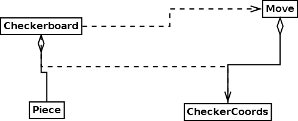

# Overview

## Purpose

This specification defines the in-memory representation of the checkerboard
used by both the server and the client.

This specification is written in a language-agnostic manner, but should
be implemented in C#.

## Scope

This specification defines the in-memory workings of the checkerboard. It
also describes how the UI will interact with the API in pseudocode.

This specification does not discuss the details of the UI or how
the server uses the checkerboard API.

## Class Diagram



# Objects

## `class Checkerboard`

### Fields

#### `grid:Piece?[8, 8]`

This is an 2D array (8x8) that holds the game pieces. Methods of `Checkerboard`
modify this state. If there is nothing on a given square, it stores `null`.

### Constructors

#### Constructor `Checkerboard()`

This constructor sets up the checkerboard in the starting position with
red pieces at the top and white at the bottom. The layout looks like this:

```
  r   r   r   r
r   r   r   r
  r   r   r   r
.   .   .   .
  .   .   .   .
w   w   w   w
  w   w   w   w
w   w   w   w
```

#### Constructor `Checkerboard(description:[(int, string)])`

This constructor sets up the checkerboard to a user-specified position.
The descriptor is a list of pairs `(square_id, piece_descriptor)` that
lists what pieces are on the board. This constructor is designed for
easy debugging.

`square_id` is a number from 1-32, each one corresponding to a single
green square on the checkerboard. (See [USA Checkers](www.usacheckers.com)
for more information on this notation)

`piece_descriptor` is a single character string that represents what type
of piece. There are four possible values:

* `r` - red piece
* `R` - red king
* `w` - white piece
* `W` - white king

Example descriptor and corresponding board:

`[(1, 'r'), (14, 'r'), (23, 'w'), (8, 'W')]`

```
  r   .   .   .
.   .   .   W
  .   .   .   .
.   r   .   .
  .   .   .   .
.   .   w   .
  .   .   .   .
.   .   .   .
```

NOTE: We may decide to use JSON instead of a list of pairs in a future
version of this specification.

### Instance Methods

#### `is_valid(loc:CheckerCoords):bool`

Given `(row, col)` coordinates on the checkerboard, this function determines
whether the coordinates are a valid location for a checker. This requires
checking the following:

* `loc.row` must be in the range `[0, 8)`
* `loc.col` must be in the range `[0, 8)`
* `loc.diagonal_num` (the sum of `loc.row` and `loc.col` must be an odd
   number. See the following diagram:

```
  0 1 2 3 4 5 6 7
  -----------------
0|   1   3   5   7   32 valid squares of the checkerboard.
1| 1   3   5   7
2|   3   5   7   9
3| 3   5   7   9     numbers in the grid are the sum of row + column
4|   5   7   9   11
5| 5   7   9   11
6|   7   9   11  13
7| 7   9   11  12
```

Note that each diagonal has a unique number. Furthermore, the valid
squares all fall on diagonals with an odd number.

#### `is_empty(loc:CheckerCoords):bool`

Check if a location is empty in the checkerboard.

This is a convenience method. it should be equivalent to

`get(loc) == null`

This method should raise an exception if the location is not a valid
checkerboard square

#### `put(loc:CheckerCoords, piece:Piece?)`

Place the piece (or null) into the checkerboard at location `loc`.

This should throw an exception if the location is invalid.

#### `get(loc:CheckerCoords):Piece?`

Get a reference to the piece at location `loc` or `null` if no piece
exists there.

This should throw an exception if the location is invalid.

#### `remove(loc:CheckerCoords):Piece?`

Remove a piece from the checkerboard at a given location. The removed
piece is returned.

If there is nothing at the location in the checkerboard, this method
is essentially a no-op that returns `null`

This should throw an exception if the location is invalid.

#### `find_piece_locations(color:Color):[CheckerCoords]`

Given a color (red or white) search the checkerboard for pieces of that color
and return a list of their locations.

#### `perform_move(move:Move)`

Given a move description, perform the move. This involves the following:

* the piece at the source location is removed from the grid
* this piece is then put into the grid at the destination location.
* if the piece reaches the 8th row of the opposite side, the piece
  becomes a king.
* if the move type is a capture move, the enemy piece between the source
  and destination square is removed from the grid.

This should raise an exception if the move is invalid on the checkerboard.

#### `find_basic_moves(loc:CheckerCoords):[Move]`

Get a list of all valid basic moves from a given start location. Basic
moves require a piece to move to a diagonally adjacent empty square:

```
x . x
. W . xs mark destination squares
x . x
```

Valid moves must meet ALL of the following criteria

* The destination square must be valid
* The destination square must be empty
* red pieces can only move downwards
* white pieces can only move upwards
* kings have no restrictions on the direction of movement.

This method should raise an exception if the start location is invalid.

#### `find_capture_moves(loc:CheckerCoords):[Move]`

Get a list of all valid capture moves from a given start location. Capture
moves require a piece to jump over an enemy piece to an empty square.

```
x . . . x
. w . w .    xs mark the destination squares. white pieces are enemies.
. . R . .
. w . w .
x . . . x
```

Valid moves must meet ALL of the following criteria:

* The destination square must be valid
* The destination square must be empty
* The square that is in between the source and destination squares
  must contain a piece of the opposite color as the piece in the source
  square.
* red non-king pieces can only move downwards
* white non-king pieces can only move upwards
* king pieces have no restrictions on the direction of movement.

This method should raise an exception if the start location is invalid.

#### `find_all_basic_moves(color:Color)[Move]`

This method should do the following:

1. Get a list of piece locations from `find_piece_locations(color)`
2. Call find_basic_moves() for each of the locations
3. Gather all of the resulting `Move`s into one big list and return it.

#### `find_all_capture_moves(color:Color)[Move]`

This method should do the following:

1. Get a list of piece locations from `find_piece_locations(color)`
2. Call find_capture_moves() for each of the locations
3. Gather all of the resulting `Move`s into one big list and return it.

#### `find_all_moves(color:Color)[Move]`

Return the results of `find_all_basic_moves(color)` and
`find_all_capture_moves(color)` as one big list. of moves

#### `to_string():String`

Return a string representation of the checkerboard similar to the ASCII
diagrams used in this document.

#### `to_descriptor():[(int, string)]`

Serialize the board state into a list of `(square_id, piece_descriptor)`
for debugging purposes. See the corresponding constructor for more info.

NOTE: This may return JSON instead of a list of pairs. This will be decided
in the next version of the spec.

#### `serialize():???`

Serialize the board for communication with the server.

NOTE: As of this version of the specifications we have not yet decided on a
data format.

## `class CheckerCoords`

`CheckerCoords` represents coordinates on the checkerboard. It is basically
a `(row, col)` pair with certain mathematical operations and other minor
features.

### Constructor `CheckerCoords(row:int, col:int)`

### Properties

#### `row:int`

Row number as an integer.

#### `col:int`

Column number as an integer.

### Methods

#### `+(other:CheckerCoords):CheckerCoords`

Perform the calculation `(row + other.row, col + other.col)`

#### `-(other:CheckerCoords):CheckerCoords`

Perform the calculation `(row - other.row, col - other.col)`

#### `*(scalar:int):CheckerCoords`

Scale the coordinates by an integer:

`(scalar * row, scalar * col)`

This will come in handy when searching for valid moves. The diagonal directions
can be scaled up by 2 to find possible destination squares.

#### `/(divisor:int):CheckerCoords`

Divide the coordinates by an integer. This is mainly used in `midpoint()`

`(row / divisor, col / divisor)`

This may raise a divide by 0 error if the divisor is 0

### Static Methods

#### `midpoint(a:CheckerCoords, b:CheckerCoords):CheckerCoords`

Compute `(a + b) / 2`. This can be used to find the location of the enemy piece
given only the source and destination of a capture move.

#### `to_coords(square_id:int):CheckerCoords`

Take a piece number from 1-32 and return the (row, col) in the grid.

These coordinates are calculated with the following algorithm:

Start with a piece number:

`1, 2, 3, ..., 32`

subtract 1 from the piece number to get the index

`0, 1, 2, ..., 31`

get the row number by dividing the index by the max number of checkers/row

`0, 0, 0, 0, 1, 1, 1, 1, 2, 2, 2, 2, ..., 7, 7, 7, 7`

On the checkerboard:

```
0   0   0   0
1   1   1   1
2   2   2   2
3   3   3   3
4   4   4   4
5   5   5   5
6   6   6   6
7   7   7   7
```

get the column in a rectangular grid by doing index mod max checkers/row:

`0, 1, 2, 3, 0, 1, 2, 3, ...,  0, 1, 2, 3`

On the checkerboard:

```
0   1   2   3
0   1   2   3
0   1   2   3
0   1   2   3
0   1   2   3
0   1   2   3
0   1   2   3
0   1   2   3
```

The range of these column numbers is too small, multipy by 2 to get closer:

`0, 2, 4, 6, 0, 2, 4, 6, ..., 0, 2, 4, 6`

On the checkerboard

```
0)   0   2   4   6
1) 0   2   4   6
2)   0   2   4   6
3) 0   2   4   6
4)   0   2   4   6
5) 0   2   4   6
6)   0   2   4   6
7) 0   2   4   6
```

This is halfway there, note that all the odd-numbered rows are correct,
but the even rows are off by one. Adding one to the even rows gives
the correct column numbers:

```
0)   1   3   5   7
1) 0   2   4   6
2)   1   3   5   7
3) 0   2   4   6
4)   1   3   5   7
5) 0   2   4   6
6)   1   3   5   7
7) 0   2   4   6
```

This method throws an exception if the square number is outside the range
of 1-32.

#### `to_square_id(coords:CheckerCoords):int`

Given (row, col), look up the piece number. this is the inverse
of piece_to_coords.

Algorithm:
1. if the row number is even, subtract one from the column number so the
 grid is now rectangular
2. divide the column number by two since there are only 4 checkers per row
3. Convert from 2D to 1D coordinates with the formula
 index = row * pieces_per_row + col
4. Add 1 to get the piece number (1-indexed)

An exception is raised if the coordinates are not valid.

## `class Piece`

This class is a simple data type that stores information about a single
checkers piece.

### Constructors

#### Constructor `Piece(color:Color, is_king:bool)`

This is a simple constructor.

#### Constructor `Piece(descriptor:String)`

This sets `color` and `is_king` from one of the following strings:

| Descriptor | color       | is_king |
|------------|-------------|---------|
| `r`        | Color.Red   | false   |
| `R`        | Color.Red   | true    |
| `w`        | Color.White | false   |
| `W`        | Color.White | true    |

### Properties

#### `color:Color`

The color of the checker piece. Either Red or White. Red pieces
are always at the top of the board and move downwards, White pieces
do the opposite. This is the in-memory representation. The GUI may rotate
the board, but the data always has red pieces at the top.

#### `is_king:bool`

If true, the piece is a king piece. Kings can move in both directions.
Basic pieces can only move in one direction: red pieces move downwards and
white pieces move upwards.

### Methods

#### `to_descriptor():string`

Convert to one of the descriptors. See the constructors for more information.

## `class Move`

This class represents a single move on the checkerboard.

### Constructor `Move(src_loc:CheckerCoords, dst_loc:CheckerCoords)`

### Properties

#### `src:CheckerCoords`

This is the source location for the move

#### `dst:CheckerCoords`

This is the destination location for the move.

### `move_type:MoveType`

This property determines the type of move based on the source and destination
locations with the following algorithm:
precondition: the piece is valid in the checkerboard

1. `offset = dst - src`
2. if `abs(offset.row) = abs(offset.col) = 1`, we have found a basic move.
   return MoveType.Basic
3. if `abs(offset.row) = abs(offset.col) = 2`, we have found a capture move.
   return MoveType.Capture
4. Otherwise, an exception should be raised since it is not a valid move.

This does not test if the move is valid given the pieces on the board, that
is the job of the `Checkerboard`.

#### `to_string():string`

Return a string `"<src#>-<dst#>"` where the two numbers are numbers
from 1-32 calculated by `CheckerCoords.to_Square_id(src)` and
`CheckerCoords.to_Square_id(dst)`

#### serialize()???

Return a binary representation of the move for sending over the network.

NOTE: As of this version of the spec, the data format has not yet been
specified.

## `enum MoveType`

* `Basic` - This represents a non-capturing move to a diagonally adjacent
  square. Example:

```
.   .     .   w
  w   ->    .
.   .     .   .
```

* `Capture` - This represents a capturing move where the piece jumps over
  an enemy piece in a straight diagonal line:

```
.   .     .   w
  r    ->   .
w   .     .   .
```

## `enum Color`

* `Red` - Red pieces are always at the top of the board in memory. The GUI
  checkerboard can be rotated 180°, but not the data behind it.
* `White` - White pieces are always at the bottom of the board in memory.

# UI Interactions

## Start of Ply

1. Get list of all possiblle moves
2. Check game over conditions (empty list of moves)
3. Get a list of all source locations from the moves

# On-Click Piece Event

* De-highlight all other pieces
* Add ability to unselect current piece
* Highlight desination squares

## On-click Destination (basic move)

* get desitation cords
* construct Move type (basic)
* call board.basic_move()
* update GUI board 
* clear clickables on GUI
* update server 
* end ply

## On-click Destination (Capture move)
* Get desitation cords
* Construct Move type (capture)
* Call board.capture_move()
* Update GUI board 
* Clear clickables on GUI
* Get list of moves from destination (To allow player to double jump)
    * if no moves found from destination: update server and end ply 
    * else: highlight destinations for destination cords only

<!-- TODO: Stephen -->

