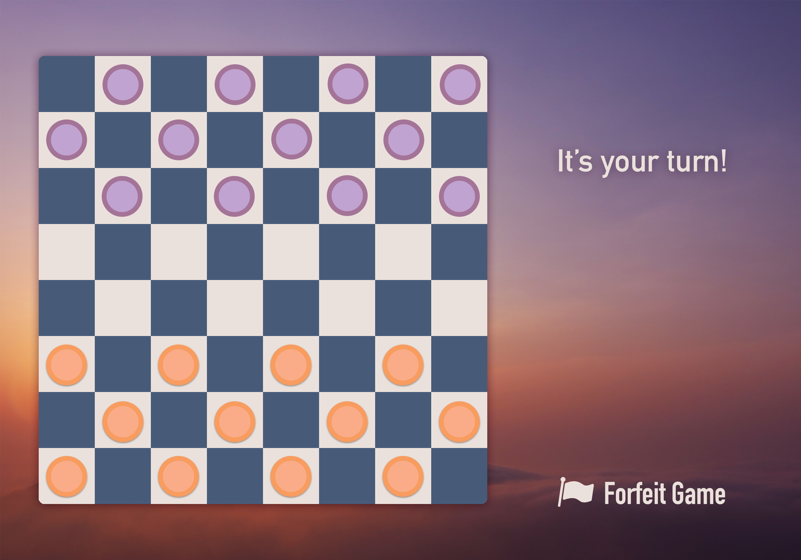
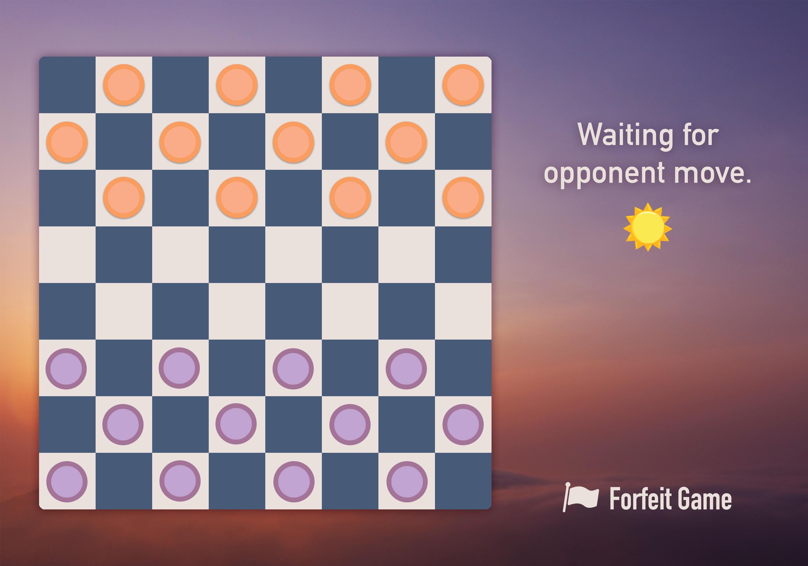
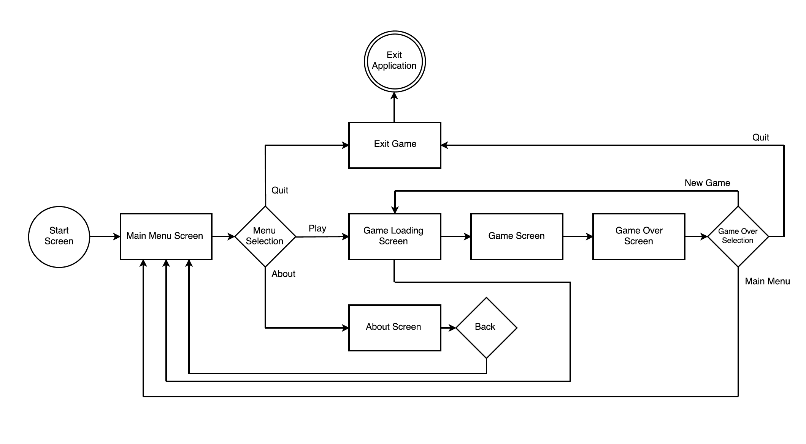
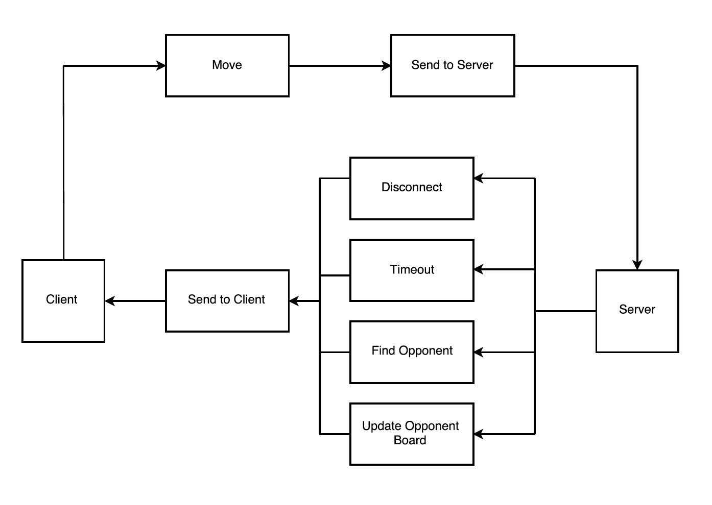

<!--
    Note: the above is just metadata to control how Pandoc renders
    the output.
-->

# Introduction

## Purpose of Document

This document will provide all the requirements for Sunset Checkers. It is a
reference for developers and users.

## Scope

This document will provide enough information so that a developer could easily
write code to our requirements.

## Overview

This document details the functional and nonfunctional requirements for Sunset
Checkers. It includes use cases and diagrams to explain the expected final
product. The requirements for the server and client are provided.

# Description

## Product Perspective

Sunset Checkers is a two player game. Each player will need their own computer to play.
Users will be matched randomly to an opponent. Each player will try to capture
all the other player's pieces or make it impossible for them to move.

The game is intended to run on 2 computers that will connect to a server.
Players will view their boards on their own screen, given a top-down view of the
board. The player's pieces will be displayed at the bottom of the board for both
players

| Player 1 view           |  Player 2 view          |
|-------------------------|-------------------------|
| { width=250px } | { width=250px } |

## Product Functions

### Server Functionality
* Match players to form a new game of checkers.
* Act as a communication channel between clients to send moves.
* Keep track of time since the last move was received and declare a timeout if
  time has surpassed 5 minutes.

### Client Functionality
* Allow the user to select game pieces to move
* Generate all possible moves a user can make based on the current board
* Check if a user has won/lost the game and properly notifies the server

## User Description

This program is designed for small groups of checkers enthusiasts. Ideal
players will be more concerned about setting up games quickly than fancy
features of the program.

## Assumptions

### Understanding the Rules of Checkers

This game assumes the user understands how to play checkers. There will not be
a tutorial.

## Dependencies

### Unity Engine

The client program is designed for the Unity game engine. If we encounter
any serious bugs in the game engine, it would prevent our project from working
altogether.

In the case that Unity breaks during the course of our project, we will try
an older version of the program. If that fails, we would have to search for
a different game engine, though this would be difficult to do on short notice.

### Internet Connection

This game of checkers is designed to operate over the internet. Therefore,
the quality of gameplay highly depends on the internet connection between
the server and clients. If one of the two players in a game has a bad
internet connection, this can lead to undesirable delays or lost connections.

To keep players from waiting too long, the application will automatically
end the game if one of the players disconnects or takes too long to respond.

\newpage

# Functional Requirements

## Frontend

### Main Menu Screen

#### Quit Option

When the user clicks the "Quit" option in the main menu, the program shall
terminate.

#### X Button

When the user clicks the program window's "X" button, the program shall
terminate.

#### About Option

When the user clicks the "About" option in the main menu, the program shall
transition to the About Screen.

#### Play Option

Clicking the "Play" option in the main menu, the program shall transition to
the Loading Screen.

### About Screen

#### Version Number

The About Screen shall display the version number of the program.

#### Release Notes

The About Screen shall display the release notes of the program.

#### Back Button

When the user clicks the "Back" option on the About Screen, the program shall
transition to the Main Menu Screen.

### Loading Screen

#### Finished Loading

When the current game finishes loading, the program shall transition to the
Game Screen.

### Game Over Screen

#### Game Results

The game over screen shall display "You Win" or "You Lose" depending on the
game results.

#### New Game Option

When the user clicks the "New Game" option, the program shall transition
to the Loading Screen to start a new game.

#### Quit Option

When the user clicks the "Quit" option, the program shall terminate.

#### Main Menu Option

When the user clicks the "Main Menu" option, the program shall transition
to the Main Menu Screen.

### Game Screen

#### Moving User Pieces

The user shall use the mouse to move the user's pieces.

#### Moving Opponent Pieces

The program shall automatically move the opponent's pieces.

#### Validation

The user shall only be able to select valid moves.

#### Forfeit Transition

When the user clicks "Forfeit", the program shall transition to the Game Over
Screen.

#### Forfeit Automatic Loss

When the user clicks "Forfeit", the user automatically loses the current game.

#### Game Over Transition

When the program detects that one of the players has lost, the program shall
transition to the game over screen.

### Checkers Rules

The following is a list of rules for the game of Checkers that our program
uses. This does not include some tournament rules such as those for timed
games.

#### Basic Moves

Any game piece can move to an empty, diagonally adjacent square.

#### Capture Moves

Any game piece can jump over an adjacent opponent's piece to an empty
square.

#### Capture Chains

Once a player performs a capture move, the player must continue performing
capture moves until there are none available for the playing piece.

#### Game Over Condition

At the start of either player's turn, if there are no available valid moves,
the game ends.

#### Determining the Loser

At the start of either player's turn, if there are no available valid moves,
that player loses the game.

#### Basic Playing Piece Movement

Non-king pieces shall be able to move forwards only. "Forwards" means toward
the opponent's side of the board.

#### Crowning Moves

When a basic playing piece reaches the eighth row of the board (the row
closest to the opponent), the piece turns into a king.

#### Crowning Moves: End of Turn

After a crowning move occurs, the player's turn immediately ends.

#### King Playing Piece Movement

King playing pieces shall be able to move both forwards and backwards.

## Backend

### Multiple Connections

More than one game should be able to be played at the same time by different
users.

### Matchmaking

The server will match the player with a random opponent who is also looking to
play a game.

### Matchmaking Timeout

The server will continue searching until a player is found or
a timeout occurs.

# Non-Functional Requirements

## Frontend

### Maximum Wait Time

The user shall not have to wait more than 3 minutes at any point in the
program.

### Intuitive UI

The UI shall be intuitive enough for users to use without explanation.

### Language

The frontend shall be written in C#.

### Unity Game Engine

The frontend shall be written in Unity Engine.

## Backend

### Scalability

This should be expandable from 10 users to 1000 will no additional effort
needed.

### Performance
There should be little to no lag in relaying the received move from one client
to the other. Immediate updates are not imperative to playing online checkers,
so a small amount of lag is acceptable.

### Backend Operating System Requirements

The backend server is expected to run on macOS and Linux.

### Language

The server shall be written in C#.

\newpage

# UI

| Screen Navigation |
| ----------------- |
||

\newpage

## Main Menu Screen

* Play Game button will allow the user to be randomly matched with another
  player to start a new game of checkers.
* About button will navigate to the about screen which provides details about
  the version of Sunset Checkers.
* Quit button allows the user to close the game window.

| Main Menu Screen |
| ---------------- |
||

\newpage

## About Screen

* Text to give an overview description, credits and release notes of
  Sunset Checkers
* Text to display the version number.

| About Screen  |
| ------------- |
||

\newpage

## Loading Screen

* A simple screen with a progress indicator to show that a game is loading i.e.
  waiting for the player to be matched.

| Loading Screen |
| -------------- |
||

\newpage

## Main Game Screen

* Approximately 2/3 of the screen will be taken up by the checkerboard and
  checker pieces on the left-most side of the game screen.
* A forfeit button will allow the user to give up their current game as a loss.
* Text on the screen will indicate whose turn it is.

| Main Game Screen |
| ------------- |
||

\newpage

## Game Over Screen

* Text will tell the user that the game is over.
* Text will tell which player won/lost the game.
* Play Again button will allow the user to be rematched with a new opponent.
* Main Menu button will allow the user to return to the Main Menu screen.

| Game Over Screen |
| ------------- |
||
\newpage

# Use Cases

## Click Piece

**Precondition:** It is Player 1's move.

**Action:** Player 1 clicks a piece that they want to move.

**Postcondition:** The piece is highlighted.

## Basic Move

**Precondition:** It is player 1's turn, and a piece is highlighted.

**Action:** The player clicks a tile 1 diagonal space away from the highlighted
piece.

**Postcondition:** The piece moves to the selected tile. It is now player 2's
turn.

## Capture Move

**Precondition:** It is player 1's turn, and a piece is highlighted. There is an
opponent piece in between player 1 and an empty space.

**Action:** The player clicks a tile 2 diagonal space away from the highlighted
piece.

**Postcondition:** The piece moves to selected tile and opponent piece is
removed from play. It is now player 2's turn.

## King

**Precondition:** It is player 1's move and there is a piece highlighted.

**Action:** Player 1 moves the piece to the 8th row, closest to their opponent.

**Postcondition:** The piece is now a king.

## Game Ends

**Precondition:** Player 1 has 1 piece left.  

**Action:** Player 2 captures player 1's last piece.

**Postcondition:** The game ends and both users are presented with the option to
find another game, go to main menu, or exit game.

## Find a Game

**Precondition:** User is at title screen.

**Action:** User clicks Play Game.

**Postcondition:** Server starts to look for a random opponent to match with
player.

## Find a Game (After Game is Over)

**Precondition:** One player loses all their pieces and the game ends.

**Action:** The user clicks New Game.  

**Postcondition:** Server looks for a new random opponent to match player with.

## Return to Main Menu

**Preconditon:** One player loses all their pieces and the game ends.

**Action:** The user clicks Main Menu.

**Postcondition:** The user is brought to the title screen.

## Exiting Game

**Preconditon:** One player loses all their pieces and the game ends.

**Action:** The user clicks exit game.

**Postconditon:** The program is terminated.

\newpage

# Activity Diagram
| Activity Diagram |
| ------------- |
||

# Glossary

**King:** A game piece that can move both forwards and backwards.

**Crowning Move:** A move that turns a basic game piece into a king. This
happens when a piece reaches the 8th row.

**Unity:** Unity Engine, a popular game engine.
